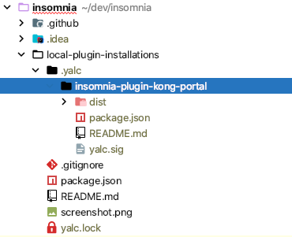
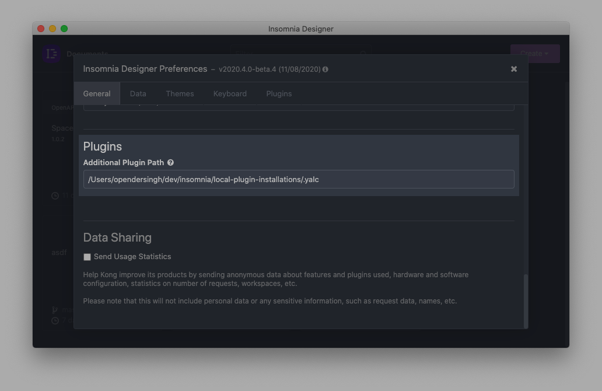

# Why?

Use [yalc](https://github.com/whitecolor/yalc) to emulate the production installation of plugins, without having to publish them to NPM. This is useful for development.

### One time setup
```sh
# Install `yalc` globally
npm install -g yalc

# Publish a plugin to yalc
cd insomnia/plugins/insomnia-plugin-kong-portal
yalc publish

# Install the plugin into this directory
cd insomnia/local-plugin-installations
yalc add insomnia-plugin-kong-portal --pure
```

After installation, your directory structure should look like this:



Now, set the `insomnia/local-plugin-installations/.yalc` directory, as an additional plugin path within Insomnia preferences:



### Active development
```sh
# Make changes to your plugin, and re-publish to reinstall the plugin
cd insomnia/plugins/insomnia-plugin-kong-portal
yalc publish --push

# Reload plugins via Insomnia Preferences > Plugins > Reload Plugins
```
