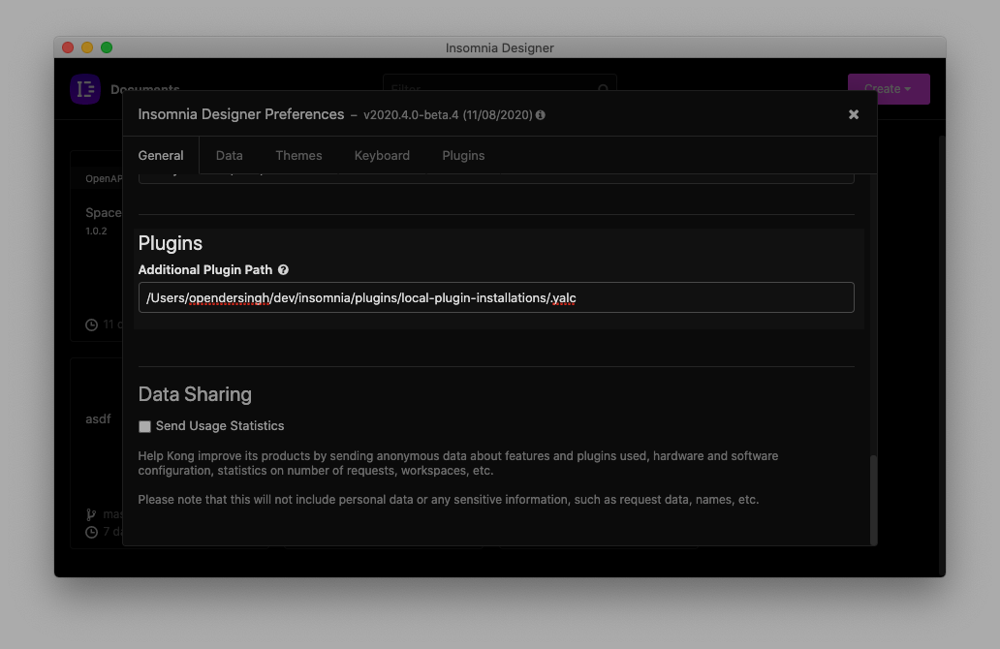

## Setup
### One time
```sh
# Install `yalc` globally
npm install -g yalc

# Publish a plugin to yalc
cd ../insomnia-plugin-kong-portal
yalc publish

# Install the plugin into this directory
cd ../local-plugin-installations
yalc add insomnia-plugin-kong-portal --pure
```

After the above steps are complete, mark the `local-plugin-installations/.yalc` directory, as an additional plugin path within Insomnia preferences.



### Continuous
```sh
# Make changes to your package, and re-publish to reinstall the plugin
cd ../insomnia-plugin-kong-portal
yalc publish --push

# Reload plugins via Insomnia Preferences > Plugins > Reload Plugins
```
