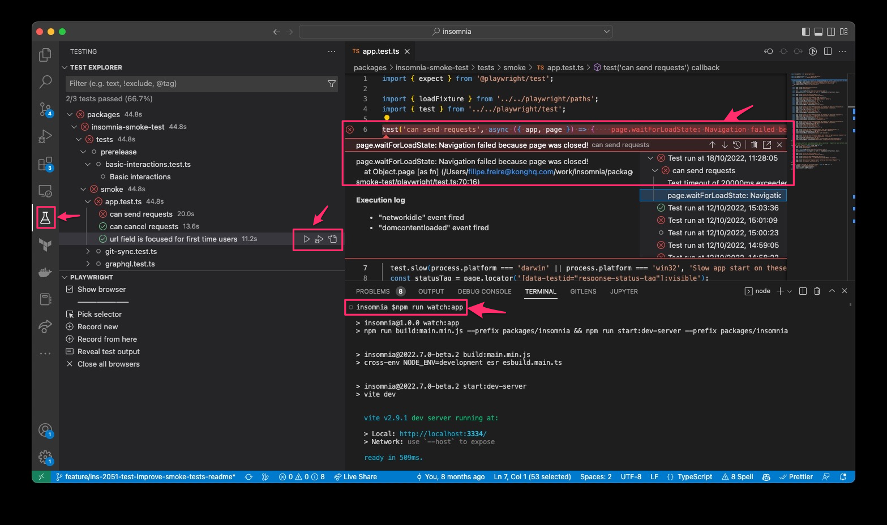
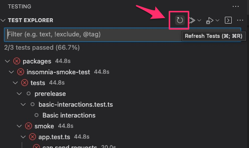
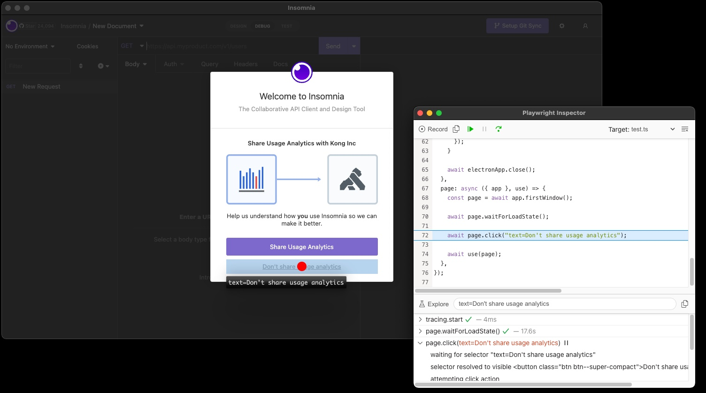
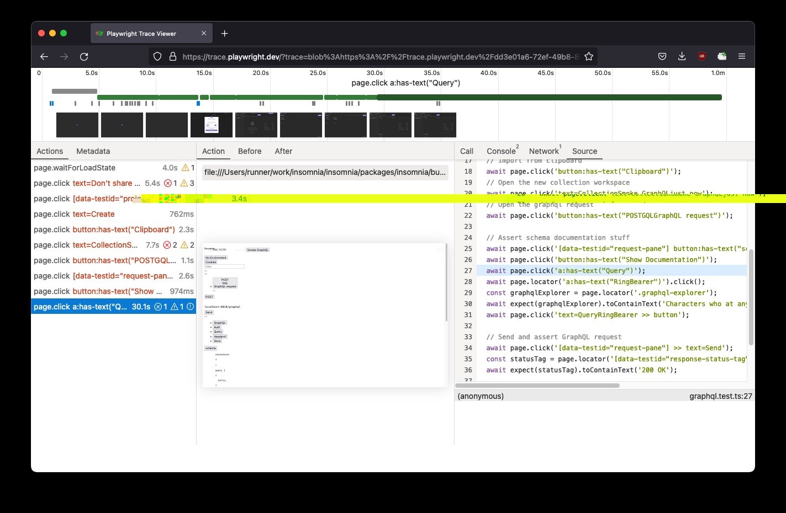
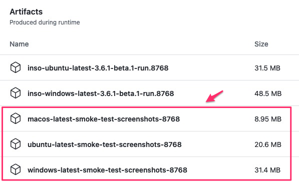

# Insomnia Smoke Tests

[](https://github.com/microsoft/playwright)

This project contains the smoke testing suite for Insomnia App.

> To find more about Inso CLI smoke tests, check [this document](CLI.md).

- [Insomnia Smoke Tests](#insomnia-smoke-tests)
  - [Quick-start](#quick-start)
  - [Debugging and Developing Tests locally](#debugging-and-developing-tests-locally)
    - [Playwright VS Code extension](#playwright-vs-code-extension)
    - [Playwright Inspector](#playwright-inspector)
    - [Playwright Trace viewer](#playwright-trace-viewer)
    - [Additional Log levels](#additional-log-levels)
  - [Reproducing CI Failures](#reproducing-ci-failures)
    - [Getting traces from CI](#getting-traces-from-ci)
    - [Build and package methods](#build-and-package-methods)
    - [Non recurring tests](#non-recurring-tests)

## Quick-start

Prerequisites:

- Clone the project
- Run `npm install`

To run all tests:

- In one terminal run: `npm run watch:app`
- In another terminal run: `npm run test:smoke:dev`

To run single tests:

- Filter by the file or test title, e.g. `npm run test:smoke:dev -- oauth`

## Debugging and Developing Tests locally

### Playwright VS Code extension

In order to run/debug tests directly from VS Code:

- Install the [Playwright extension](https://marketplace.visualstudio.com/items?itemName=ms-playwright.playwright).
- With the extension installed, run on terminal `npm run watch:app`.

You can trigger tests from the `Testing` tab, or within the test files clicking the run button.



If no tests appear, you may need to run "Refresh playwright tests". This can be done from the command palette, or by using the button at the top of the `Testing` tab.



### Playwright Inspector

You can step through tests with playwright inspector: `PWDEBUG=1 npm run test:smoke:dev`

This is also useful to help create new tests.



### Playwright Trace viewer

We generate [Playwright Traces](https://playwright.dev/docs/trace-viewer) when tests run. These can be used to debug local and CI test failures.



To open a local trace viewer for a given test output, run:

```shell
# Example:
npx playwright show-trace packages/insomnia-smoke-test/traces/app-can-send-requests/trace.zip
```

Alternatively you can upload this trace to [trace.playwright.dev](https://trace.playwright.dev/).

### Additional Log levels

You can enable additional logging to help you debug tests:

- Playwright logs: `DEBUG=pw:api npm run test:smoke:dev`
- Insomnia console logs: `DEBUG=pw:browser npm run test:smoke:dev`
- WebServer console logs: `DEBUG=pw:WebServer npm run test:smoke:dev`

## Reproducing CI Failures

### Getting traces from CI

Traces from CI execution can be found in the failed CI job's artifacts.



After downloading the artifacts, these can be extracted and loaded up into the [Trace viewer](#playwright-trace-viewer).

### Build and package methods

It's possible to run the smoke tests for:

- A `build`, the JS bundle that is loaded into an electron client
- A `package`, the executable binary (e.g. `.dmg` or `.exe`)

For `build`:

```shell
# Transpile js bundle
npm run app-build

# Run tests
npm run test:smoke:build
```

For `package`:

```shell
# Build executable in /packages/insomnia/dist
npm run app-package

# Run tests
npm run test:smoke:package
```

Each of the above commands will automatically run the Express server, so you do not need to take any extra steps.

### Non recurring tests

Non recurring / non-CI tests, like pre-release ones, can be run using [Playwright VS Code extension](#playwright-vs-code-extension) or by running `test:dev` against the desired test file:

```shell
npm run test:dev -w packages/insomnia-smoke-test -- preferences-interactions
```
