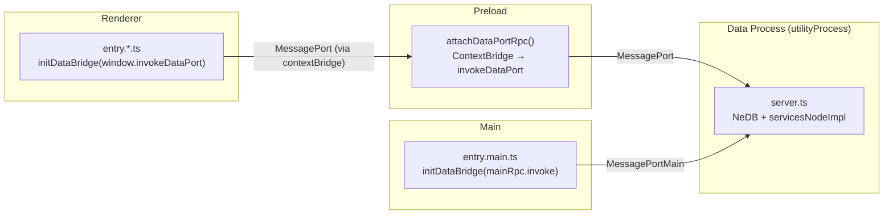
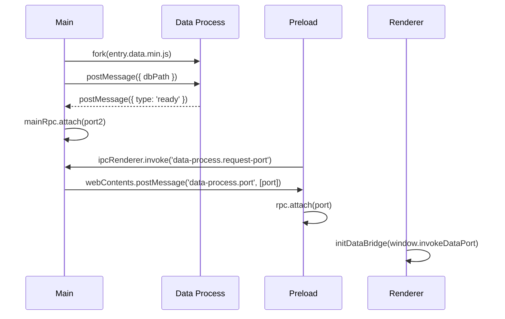

# data-process

Isolated utility process that owns the NeDB database and all service implementations. Main and renderer communicate with it via MessagePort RPC.

## Topology



Each process creates a `PortRpc`, attaches it to its transport, then calls `initDataBridge(invoke)` to wire up database and services proxies.

### Init sequence



## File map

| File | Role |
|---|---|
| `port-rpc.ts` | Transport-agnostic RPC client. `attach` / `invalidate` / `invoke`. |
| `server.ts` | Data-process side. Listens for `new-port` messages, routes `invoke` requests to NeDB or services. |
| `data-process-manager.ts` | Main-process side. `spawnDataProcess` forks the utility process, exports `mainRpc`. `issuePort(window)` hands a port to a renderer window. Restarts on crash. |
| `data-port-preload.ts` | `attachDataPortRpc(context)` — wires up `PortRpc` in a preload script and returns `InvokeFn`. |
| `init-data-bridge.ts` | `initDataBridge(invoke, options?)` — builds database + services proxies and calls `initDatabase` / `initServices`. Used by every renderer entry and the main process. |
| `serialization.ts` | `serializeError` / `deserializeError` for structured error transport across MessagePort. |

## Usage per process

### Preload (all windows)

```ts
const invokeDataPort = attachDataPortRpc('my-window-preload');
contextBridge.exposeInMainWorld('invokeDataPort', invokeDataPort);
```

### Renderer entry

```ts
await initDataBridge(window.invokeDataPort, {
  database: { onChange: listener => ... }, // optional overrides
});
```

### Main process

```ts
await spawnDataProcess(dbPath);
await initDataBridge(mainRpc.invoke, {
  database: { init: async () => {}, onChange: listener => registerMainProcessChangeListener(listener) },
});
```

## Adding a new window

1. Preload: `attachDataPortRpc('my-window')`, expose result as `window.invokeDataPort`.
2. Entry: `await initDataBridge(window.invokeDataPort)`.
3. Main: `issuePort(window)` is called automatically when the window sends `data-process.request-port`.

## Debugging

In development, `spawnDataProcess` passes `--inspect=9229` to the utility process. The VSCode `Insomnia` compound attaches to it automatically alongside the main process and renderer.
