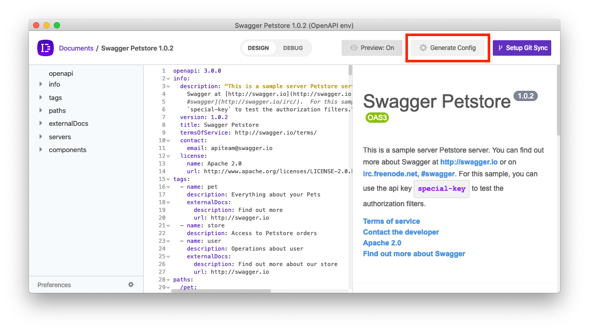
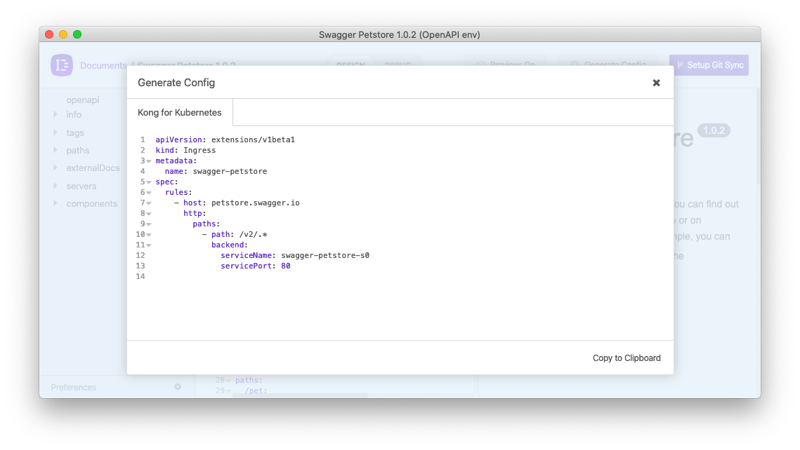

# Kong for Kubernetes Config (Insomnia Plugin)

This is a plugin for [Insomnia](https://insomnia.rest) to add the ability to generate Kong for Kubernetes Config.

## Installation

Install the `insomnia-plugin-kong-kubernetes-config` plugin from Preferences > Plugins.

## Usage

Once this plugin is installed, open a document with an OpenAPI specification and navigate to the `Design` view.

If installed correctly, a button titled `Generate Config` will appear in the header (you may need to reopen the document).

Click on this button to open a modal, showing all of the config generator plugins installed and their output. From here, you can copy the config to your clipboard and execute on your platform. This config will regenerate each time you click on the button, so that changes in your specification are included.

