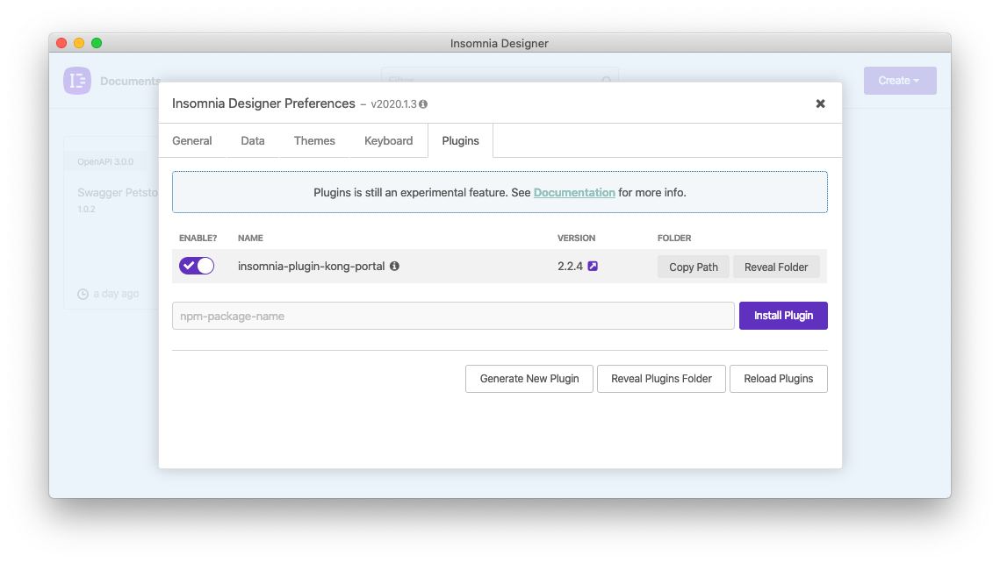
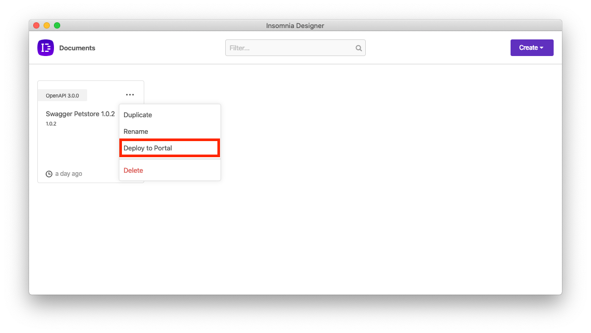
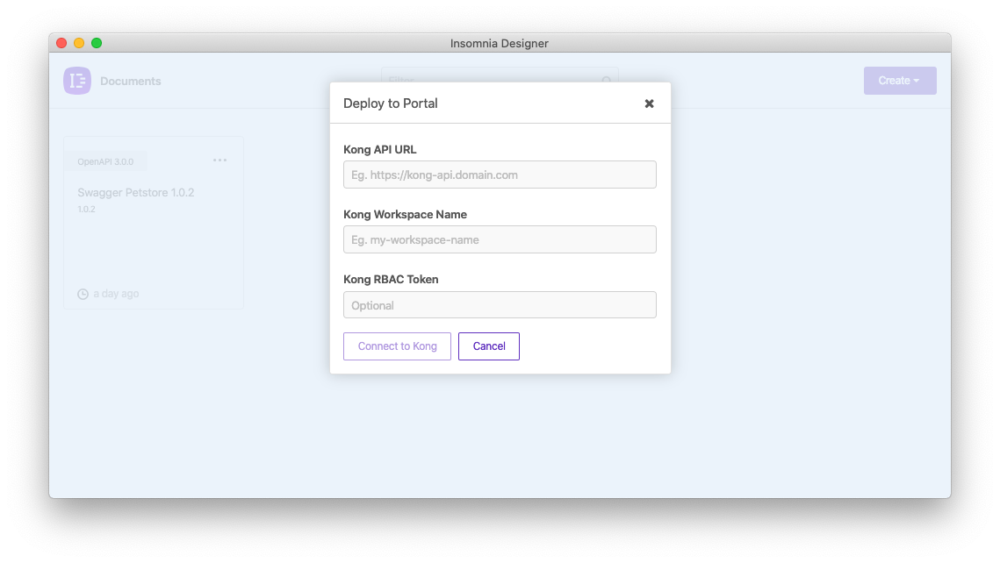

# Kong Portal Deploy (Insomnia Plugin)

This is a plugin for [Insomnia](https://insomnia.rest) to add the ability to deploy API specifications to Kong Portal.

## Installation

Install the `insomnia-plugin-kong-portal` plugin from Preferences > Plugins.

## Usage

Once this plugin is installed, navigate to the homepage and click `...` to open the menu for a document.

If installed correctly, an option titled `Deploy to Portal` will appear.

Click on this button and enter your URL, workspace name and RBAC token in order to connect to Kong.

